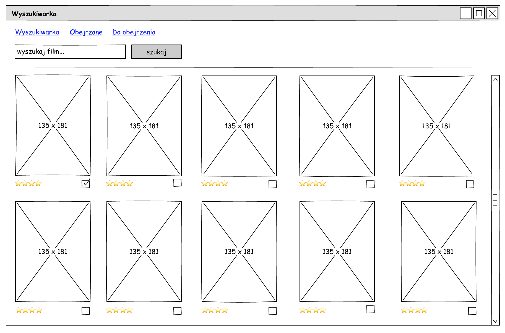
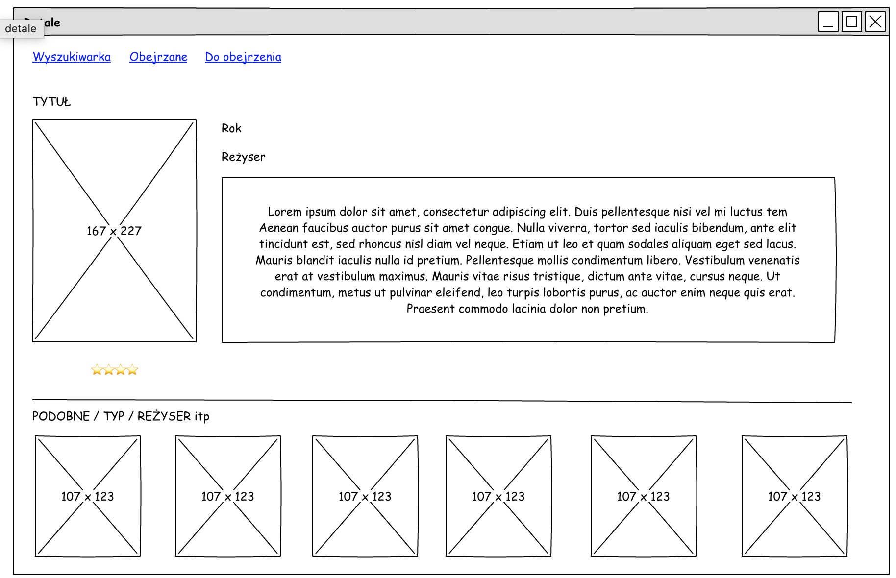

# Kilka ważnych informacji

Przed przystąpieniem do rozwiązywania zadań przeczytaj poniższe wskazówki

## Jak zacząć?

1. Stwórz [*fork*](https://guides.github.com/activities/forking/) repozytorium z zadaniami.
2. Sklonuj fork repozytorium (stworzony w punkcie 1) na swój komputer. Użyj do tego komendy `git clone adres_repozytorium`
Adres możesz znaleźć na stronie forka repozytorium po naciśnięciu w guzik "Clone or download".
3. Rozwiąż zadania i skomituj zmiany do swojego repozytorium. Użyj do tego komend `git add nazwa_pliku`.
Jeżeli chcesz dodać wszystkie zmienione pliki użyj `git add .` 
Pamiętaj że kropka na końcu jest ważna!
Następnie skommituj zmiany komendą `git commit -m "nazwa_commita"`
4. Wypchnij zmiany do swojego repozytorium na GitHubie.  Użyj do tego komendy `git push origin main`
5. Stwórz [*pull request*](https://help.github.com/articles/creating-a-pull-request) do oryginalnego repozytorium, gdy skończysz wszystkie zadania.

Poszczególne zadania rozwiązuj w odpowiednich plikach.

### Poszczególne zadania rozwiązuj w odpowiednich plikach.

**Repozytorium z ćwiczeniami zostanie usunięte 2 tygodnie po zakończeniu kursu. Spowoduje to też usunięcie wszystkich forków, które są zrobione z tego repozytorium.**

# Aplikacja do zarządzania biblioteką filmów

Na bazie otwartego API ze strony http://omdbapi.com/, zaimplementuj aplikację do zarządzania biblioteką filmów.

Aplikacja ma udostępniać następujące funkcjonalności:

- wyszukiwarka filmów
- strona z detalami wybranego filmu
- lista obejrzanych filmów z możliwością oceny
- lista filmów "do obejrzenia"

## 1. Klucz API
Na początku należy wygenerować klucz do API. Po wejściu na stronę http://omdbapi.com/ znajdź zakładkę API Key a następnie wybierz opcję FREE. Wypełnij wszystkie wymagane pola. Po wysłaniu formularza na skrzynkę mailową podaną w formularzu przyjdzie klucz, dzięki któremu będzie można odpytywać API.

## 2. Wyszukiwarka
Widok wyszukiwarki powinien pozwolić na wyszukiwanie filmu w bazie OMDBapi. Lista filmów powinna być wyświetlana w formie okładek + tytuł + rok produkcji. Dodatkowo pod każdym filmem powinien pojawić się widget do oceny filmu w skali od 1-5. Szukasz inspiracji? Zajrzyj tu: https://codepen.io/jamesbarnett/pen/vlpkh :) Ostatnim elementem jest przycisk do oznaczenia filmu jako "chcę obejrzeć".

Kiedy użytkownik doda film jako obejrzany (przez dodanie oceny), bądź zaznaczy go jako "do obejrzenia" to przy następnym pojawieniu się na liście powinien mieć wypełnione odpowiednie pola (oceny bądź checkbox do obejrzenia).

Po kliknięciu na tytuł / plakat użytkownik przenoszony jest na stronę z detalami.

Na początku wyszukiwarka pokazuje pusty ekran powitalny np. "Hej! zacznij wyszukiwanie filmów". W trakcie wyszukiwania pokazywany jest spinner. Jeśli nastąpi błąd poinformuj użytkownika wyświetlając mu stosowny komunikat.

## 3. Strona z detalami filmu
Strona z detalami zawiera szczegółowe informacje na temat filmu. Użytkownik z tego miejsca też może ocenić film oraz dodać go do ulubionych. ID filmu powinno być odzwierciedlone w adresie URL tak aby był on łatwo kopiowalny np. moje-filmy.pl/detale/ID. Po wejściu na stronę z poprawnym ID mają się wyświetlić dane na temat filmu. Podanie błędnego ID powinno wyświetlić informację o błędzie. Podczas pobierania pokaż spinner.

**DLA CHĘTNYCH:**
Pod detalami filmu wyświetl listę filmów podobnych. Np. na podstawie reżysera, gatunku itp.

## 4. Strona z listą ulubionych / do obejrzenia
Obie listy powinny pokazywać listę filmów wraz z prostym formularzem do filtrowania np. po tytule czy gatunku. Dodatkowo użytkownik może wybrać różne metody sortowania filmów np. od oceny najwyższa-najniższa, rok wydania filmu, tytuł alfabetycznie itp.

Przy każdym filmie powinna pojawić się ikona do usunięcia filmu z listy. Np. ikona kosza.

## 5. Przechowywanie danych
Jako że nie będziemy hostować nigdzie naszej aplikacji, dobrze by było dać użytkownikowi możliwość zapisu. Dane zapisuj do localStorage.